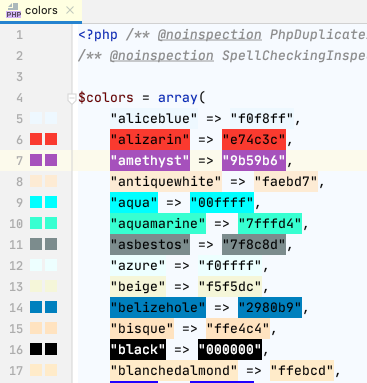
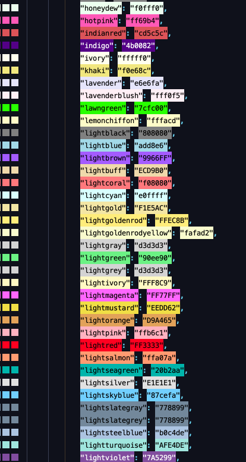
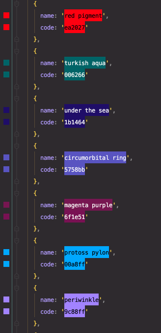
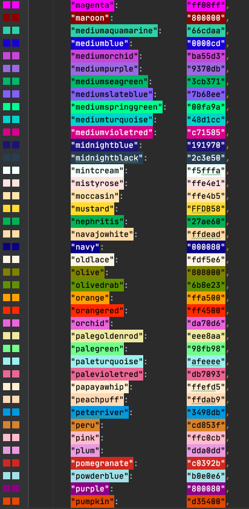
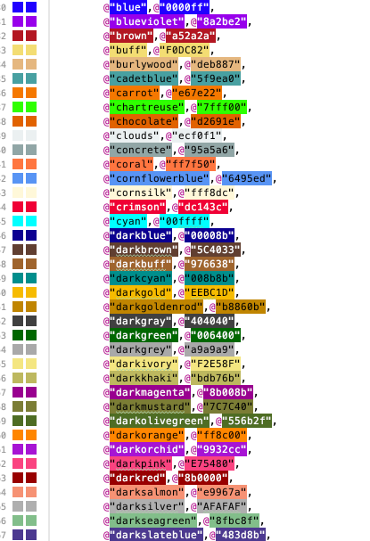
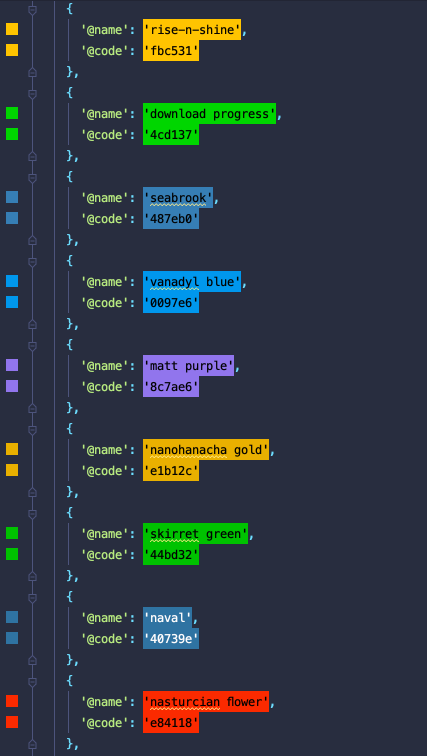
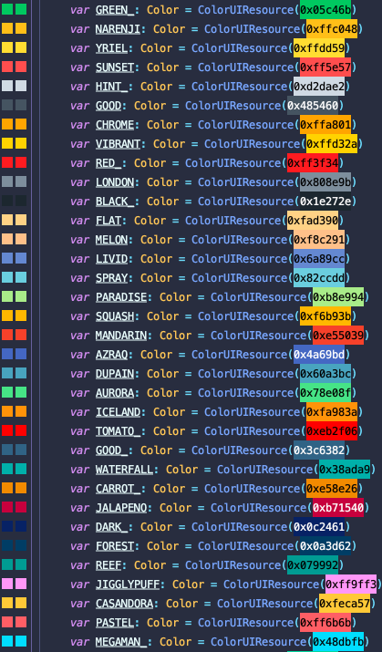
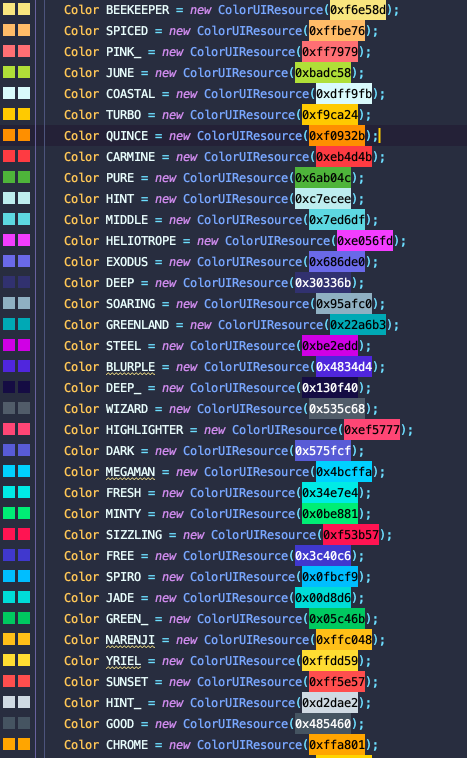
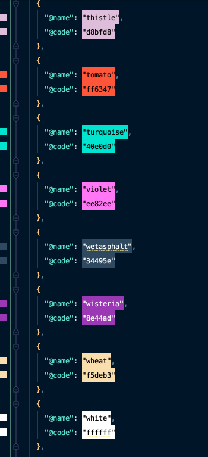
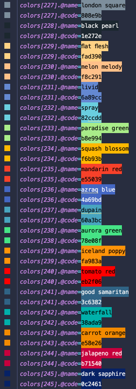

# Color Highlighter

<h1 align="center">
   
    
    
</h1>

**Preview your colors inline!**

## Features

- Colorize different color formats directly in the code
  - `HEX` with or without hash (`#`) with alpha support
  - `rgb()` and `rgba()`
  - `hsl()` and `hsla()`
  - Java/Kotlin/Scala -> `ColorUiResource`
  - Java/Kotlin: `[new ]Color(r, g, b[, a])`
  - *ASCII Colors* and *Web Colors* (https://en.wikipedia.org/wiki/Web_colors)
  - *FlatUI Colors* (https://flatuicolors.com/)
  - Custom Colors (**NEW!**)

- Supports most languages (more to come)
  - HTML
  - XML
  - YAML
  - Properties
  - JSON
  - JavaScript
  - TypeScript
  - Scala
  - Java
  - Kotlin
  - Ruby
  - Python
  - PHP
  - Go
  - ObjectiveC
  - Swift
  - C
  - C++
  - C# (**NEW**)
  - Markdown (**NEW**)

- Ability to preview color in the gutter
- Options to copy gutter color in different formats (rgb, hsl, etc)
- You can disable certain parsers

## Screenshots

#### PHP

#### Python

#### Ruby

#### Go

#### Objective C

#### Swift

#### JavaScript

#### Kotlin

#### Java

#### JSON

#### Properties

## Acknowledgements

Plugin Icon made by [Vectors Market](https://www.flaticon.com/authors/vectors-market)
from [Flaticon](http://www.flaticon.com), licensed
by [Creative Commons BY 3.0](http://creativecommons.org/licenses/by/3.0/)

## Authors:

- [Elior Boukhobza (mallowigi)](https://github.com/mallowigi)
