# Features

Color Highlighter previews colors inline across a wide range of languages and
formats. Here is what it can do.

## Inline Color Previews

Colors written in your code are rendered directly in the editor so you can see
them at a glance. The way they appear depends on the
[highlighting style](/guide/configuration#highlighting-style) you pick.


## Multiple Highlighting Styles

Choose how colors are displayed:

| Style                     | Description                                                         |
| ------------------------- | ------------------------------------------------------------------- |
| **Background**            | Paints the color behind the text.                                   |
| **Border**                | Draws a border around the color value.                              |
| **Underline pill**        | Draws a rounded "pill" underline beneath the value.                 |
| **Glow outline**          | Surrounds the value with a soft colored glow.                       |
| **Underline**             | Underlines the color value.                                         |
| **Foreground**            | Paints the text itself in the color.                                |
| **Inline**                | Renders a small colored icon (swatch) next to the value.            |
| **Disabled (Gutter only)** | No inline highlight — the color is only shown in the gutter.       |

For the **Background** and **Border** styles you can also set a
[rounded arc radius](/guide/configuration#highlighting-style) (1–10) for softer
corners.

### Styles Gallery

<div class="masonry">
  <figure>
    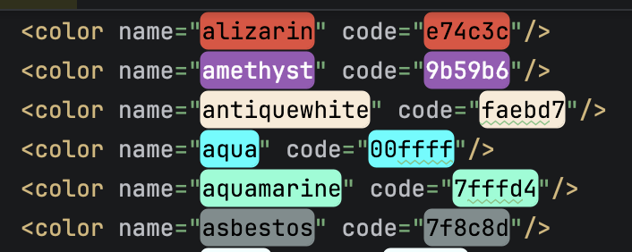
    <figcaption>Background</figcaption>
  </figure>
  <figure>
    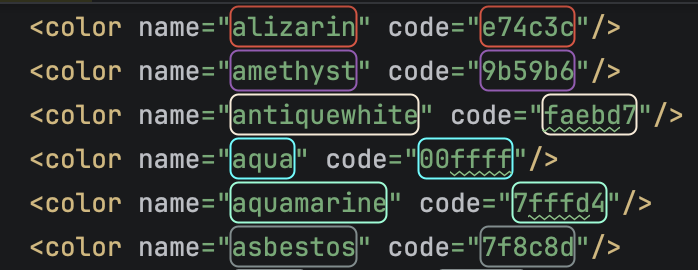
    <figcaption>Border</figcaption>
  </figure>
  <figure>
    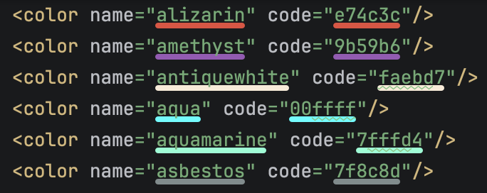
    <figcaption>Underline pill</figcaption>
  </figure>
  <figure>
    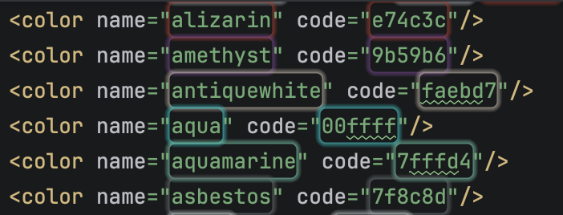
    <figcaption>Glow outline</figcaption>
  </figure>
  <figure>
    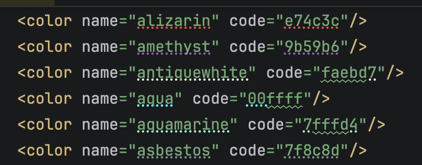
    <figcaption>Underline</figcaption>
  </figure>
  <figure>
    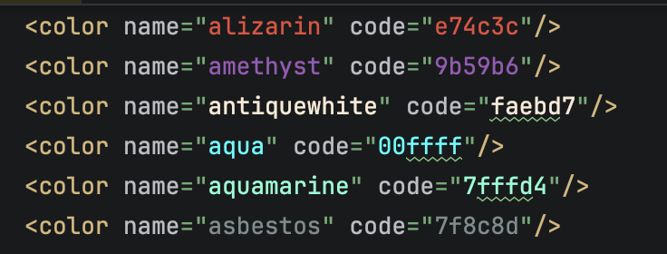
    <figcaption>Foreground</figcaption>
  </figure>
  <figure>
    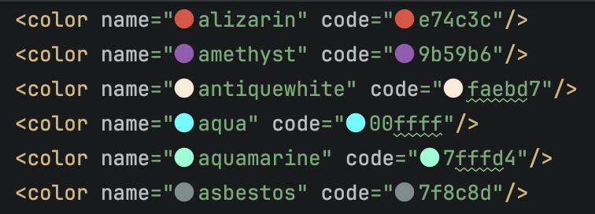
    <figcaption>Inline</figcaption>
  </figure>
  <figure>
    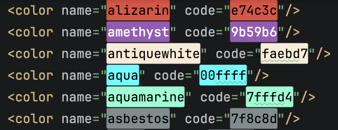
    <figcaption>No radius</figcaption>
  </figure>
  <figure>
    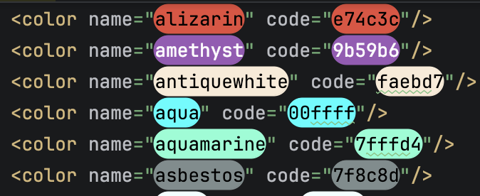
    <figcaption>Large radius</figcaption>
  </figure>
</div>

## Gutter Previews

A color swatch is shown in the editor gutter next to each detected color. This
works with every highlighting style, including **Disabled (Gutter only)** when
you want previews _only_ in the gutter.

**Right-click** a gutter swatch to copy the color to the clipboard in a wide
range of formats — hex, `rgb`/`rgba`, `hsl`/`hsla`, and language-specific
constructors such as Java `Color`/`ColorUIResource`, Kotlin `Color`, Objective-C
`[NSColor …]`/`[UIColor …]`, Swift `NSColor`, Android `Color.argb()`, and C#
`Color.FromArgb()`. See [Gutter & Copying](/guide/gutter) for the full list. You
can also disable gutter icons entirely.

## Rich Format Support

Color Highlighter recognizes a lot of color notations. See the full list on the
[Color Formats](/guide/color-formats) page. Highlights include:

- `HEX` with or without a leading `#`, including alpha.
- `rgb()`, `rgba()` and `argb()`.
- `hsl()` and `hsla()`.
- Color tuples such as `(r, g, b[, a])`.
- Language constructors like Java/Kotlin `Color(r, g, b[, a])`, `ColorUIResource`,
  Objective-C `[NSColor colorWith…]`, C# `Color.FromArgb(…)`, and Rust `Rgb(…)`.
- Named colors: **ASCII / Web colors**, **FlatUI colors**, and **Tailwind colors**.
- Your own [Custom Colors](/guide/custom-colors).

## Broad Language Coverage

Dozens of languages are supported, from stylesheets and markup to Java, Kotlin,
Rust, Swift, Go, Python, PHP and more. See
[Supported Languages](/guide/supported-languages) for the full list.

## Fine-grained Detection Toggles

Every detection kind can be toggled independently so nothing is highlighted by
accident — hex strings, tuples, color names, and each language's color
constructors/properties. See [Configuration](/guide/configuration).

## Screenshots

A few examples across languages:

### CSS / Stylesheets

```css
.card {
  background: #2ecc71;
  color: rgba(0, 0, 0, 0.87);
}
```

### PHP

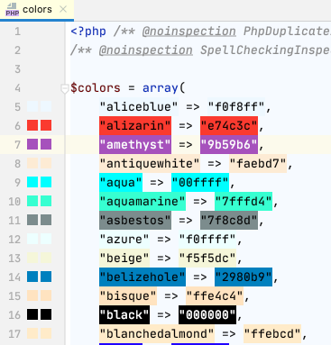

### Python

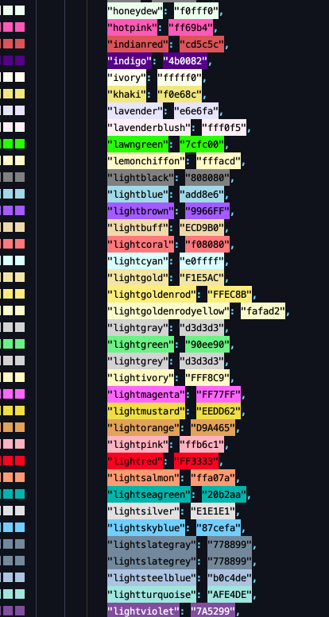

### JavaScript

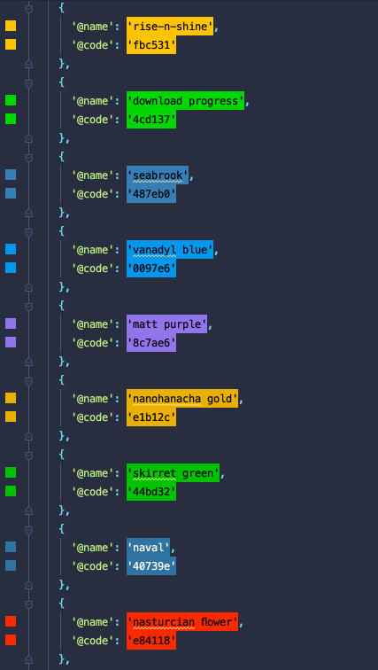

### Kotlin

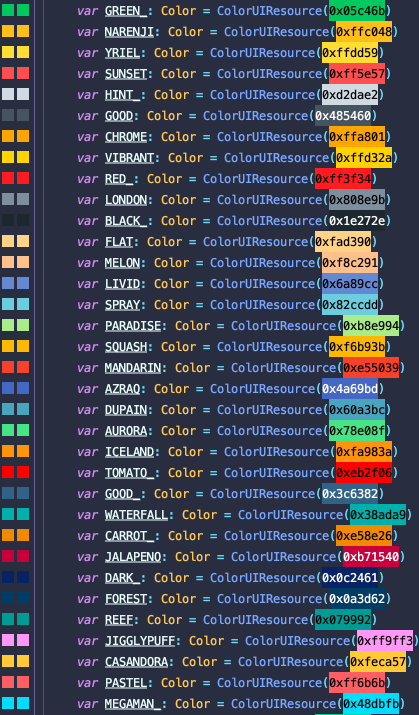

### Java

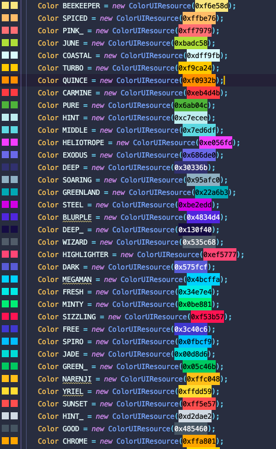

### Go

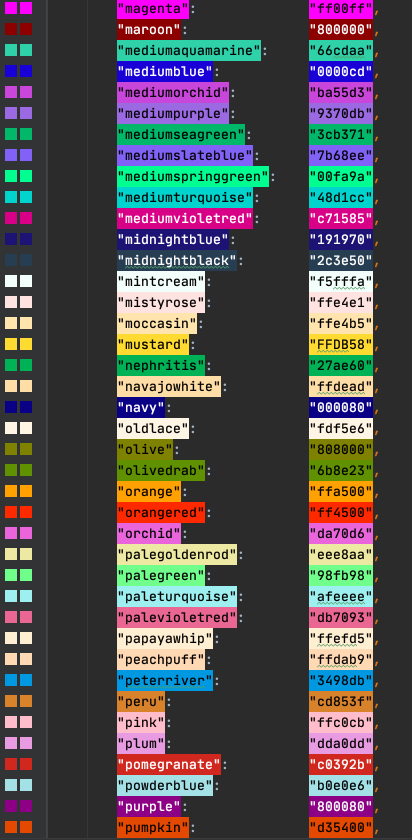

### Swift

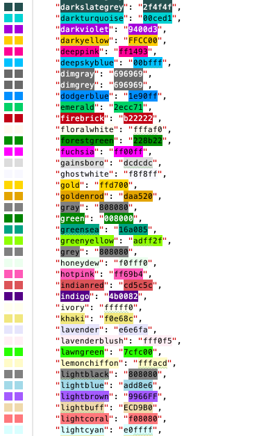

### Objective-C

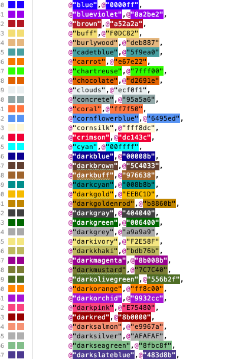
