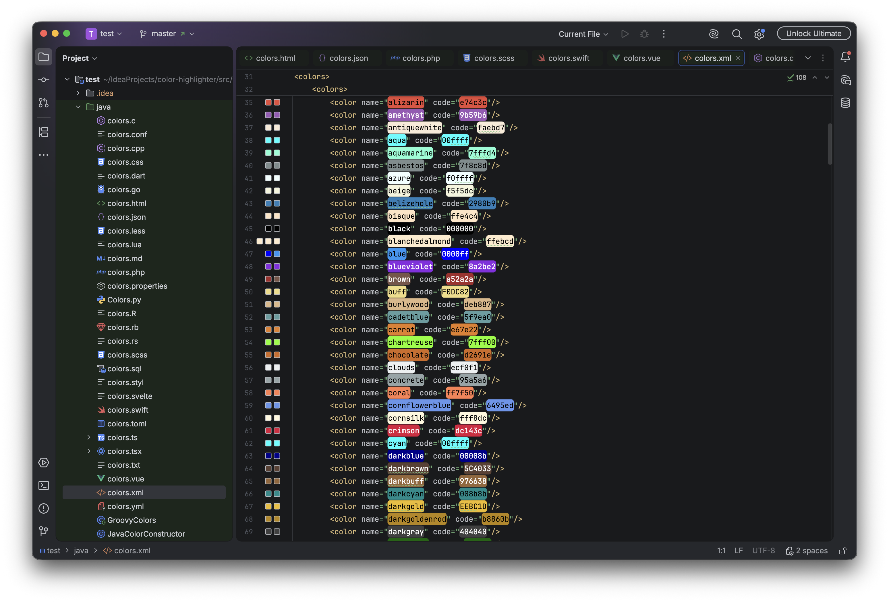

# Getting Started

Color Highlighter is a plugin for the [JetBrains family of IDEs](https://www.jetbrains.com/)
(IntelliJ IDEA, WebStorm, PyCharm, PhpStorm, RubyMine, GoLand, Rider, CLion,
DataGrip, and more). It previews colors directly inside the editor.

## Installation

### From the IDE (recommended)

1. Open your IDE and go to **Settings / Preferences**.
2. Navigate to **Plugins**.
3. Select the **Marketplace** tab and search for **Color Highlighter**.
4. Click **Install**, then restart the IDE if prompted.

### From the JetBrains Marketplace

You can also download it directly from the
[JetBrains Marketplace](https://plugins.jetbrains.com/plugin/12320-color-highlighter)
and install it via **Settings → Plugins → ⚙️ → Install Plugin from Disk…**.

## First Look

Once installed, open any file containing a color — for example a CSS file:

```css
.button {
  background: #3498db;
  color: rgb(255, 255, 255);
  border: 1px solid hsl(204, 70%, 53%);
}
```

Each color is rendered inline according to your chosen
[highlighting style](/guide/configuration#highlighting-style), and a color
preview appears in the [gutter](/guide/gutter).



## Where to Go Next

- Browse the full list of [Features](/guide/features).
- See which [languages are supported](/guide/supported-languages).
- Learn about every recognized [color format](/guide/color-formats).
- Fine-tune detection in [Configuration](/guide/configuration).
- Hitting something unexpected? Check the [Gotchas](/guide/gotchas) and
  [Troubleshooting](/guide/troubleshooting) pages.
